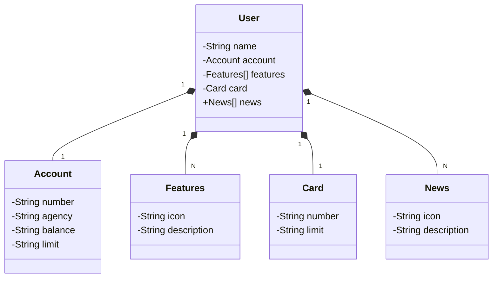

# Santander Dev Week-2025
Java RESTful API criada para a Sandander Dev Week

## Diagrama de Classes 

```mermaid
classDiagram
    class User {
        -String name
        -Account account
        -Features[] features
        -Card card
        +News[] news
    }

    class Account {
        -String number
        -String agency
        -String balance
        -String limit
    }

    class Features {
        -String icon
        -String description
    }

    class Card {
        -String number
        -String limit
    }

    class News {
        -String icon
        -String description
    }

    User "1" *-- "1" Account
    User "1" *-- "N" Features
    User "1" *-- "1" Card
    User "1" *-- "N" News
```
